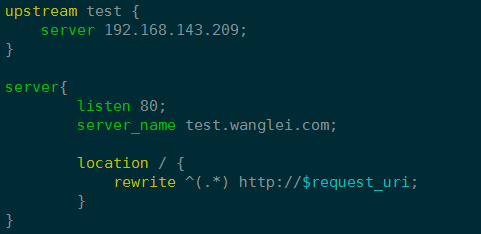

# Nginx 配置高亮语法

1. 创建目录
```
mkdir ~/.vim/syntax
mv nginx.vim ~/.vim/syntax/nginx.vim
mv filetype.vim ~/.vim/filetype.vim
```

2. 目录结构
```
.vim
├── filetype.vim
└── syntax
    └── nginx.vim
```

3. 编辑nginx查看效果

   

