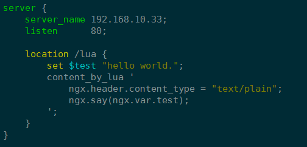
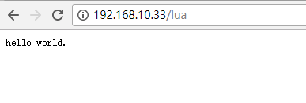

# Tengine 安装lua环境


系统版本: Ubuntu 16.04

1. 安装依赖包
```
sudo apt-get install openssl libssl-dev
sudo apt-get install libpcre3 libpcre3-dev
sudo apt-get install zlib1g-dev
sudo apt-get install lua5.1
sudo apt-get install liblua5.1-0-dev
```

2. 下载并解lua及压源码包
```
wget https://codeload.github.com/openresty/lua-nginx-module/tar.gz/v0.9.16
tar zxf lua-nginx-module-0.9.16.tar.gz

wget http://tengine.taobao.org/download/tengine-2.1.2.tar.gz
tar zxf tengine-2.1.2.tar.gz
cd tengine-2.1.2
```

3. 编译并安装
```
./configure --prefix=/home/wanglei/tengine --with-http_stub_status_module --with-http_ssl_module --with-http_gzip_static_module --with-http_concat_module --with-http_concat_module=shared --add-module=/home/wanglei/lua-nginx-module-0.9.16
make && make install
```

4. 配置tengine并进行测试



5. 启动tengine
```
sudo /home/wanglei/tengine/sbin/nginx -t
sudo /home/wanglei/tengine/sbin/nginx
```

6. 访问进行测试lua是否生效


