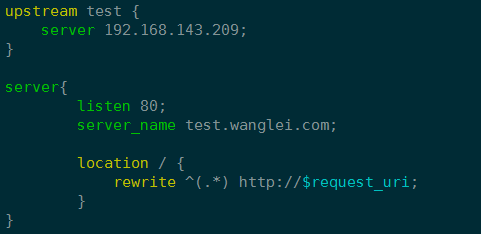

# Nginx 配置高亮语法

1. 创建目录
```
mkdir ~/.vim/syntax
mv nginx.vim ~/.vim/syntax/nginx.vim
mv filetype.vim ~/.vim/filetype.vim
```

2. 目录结构
```
.vim
├── filetype.vim
└── syntax
    └── nginx.vim
```

3. 编辑nginx查看效果




# Nginx 内置变量使用说明及具体意义

<font size=4>$args</font>
```
参数: $args
解释: HTTP请求中的完整参数。
访问: curl http://test.wanglei.com/192.168.1.200?a=10 -I
返回: "a=10"
```

<font size=4>$binary_remote_addr</font>

```
参数: $binary_remote_addr
解释: 二进制格式的客户端地址。
访问: curl http://test.wanglei.com/192.168.1.200?a=10 -I
返回: "\xC0\xA8\x01\xC8"
```


<font size=4>$body_bytes_sent</font>
```
参数: $body_bytes_sent
解释: 表示在客户端发送的http响应中,包体部分的字节数
访问: curl http://test.wanglei.com/192.168.1.200?a=10 -I
返回: "264"
```

<font size=4>$content_length</font>
```
参数: $content_length
解释: 表示客户端请求头部中的Content-Length
访问: curl http://test.wanglei.com/192.168.1.200?a=10 -I 
返回: "264"
```

<font size=4>$content_type</font>
```
参数: $content_type
解释: 表示客户端请求头部中的Content-Type
访问: curl http://test.wanglei.com/192.168.1.200?a=10 -I
返回: "text/html"
```

<font size=4>$document_root</font>
```
参数: $document_root
解释: 返回nginx服务器中资源跟目录,这取决于在server{}中定义的root路径
访问: curl http://test.wanglei.com/192.168.1.200?a=10 -I
返回: "/usr/local/nginx/html"
```

<font size=4>$uri</font>
```
参数: $uri
解释: 表示当前请求的URI,不带任何参数
访问: curl http://test.wanglei.com/192.168.1.200?a=10 -I
返回: "/192.168.1.200"
```

<font size=4>$document_uri</font>
```
参数: $document_uri
解释: 与$uri含义相同
访问: curl http://test.wanglei.com/192.168.1.200?a=10 -I
返回: "/192.168.1.200"
```

<font size=4>$request_uri</font>
```
参数: $request_uri
解释: 表示客户端发来的原始URL,带完整的参数,$request_uri永远不会变,始终是用户的原始URL
访问: curl http://test.wanglei.com/192.168.1.200?a=10 -I
返回: "/192.168.1.200?a=10"
```

<font size=4>$host</font>
```
参数: $host
解释: 表示客户端请求头部中的Host字段。如果Host字段不存在,则以实际处理的server name名称代替。如果Host字段中带有端口,如IP:PORT,那么$host会去掉端口
访问: curl http://test.wanglei.com/192.168.1.200?a=10 -I
返回: "test.wanglei.com"
```


<font size=4>$hostname</font>
```
参数: $hostname
解释: 表示Nginx所在的机器的名称,与gethostbyname调用返回的值相同
访问: curl http://test.wanglei.com/192.168.1.200?a=10 -I
返回: "centos7-201"
```


<font size=4>$is_args</font>
```
参数: $is_args
解释: 表示请求中的URL是否带参数,如果带参数,$is_args值为"?"。如果不带参数,则是空字符串
访问: curl http://test.wanglei.com/192.168.1.200?a=10 -I 
返回: "?"
访问: curl http://test.wanglei.com/192.168.1.200 -I
返回: ""
```

<font size=4>$limit_rate</font>
```
参数: $limit_rate
解释: 表示当前限制速率是多少, 0表示无限速
访问: curl http://test.wanglei.com/192.168.1.200?a=10 -I
返回: "51200"
配置: limit_rate 50k;
```

<font size=4>$nginx_version</font>
```
参数: $nginx_version
解释: 表示当前nginx的版本号
访问: curl http://test.wanglei.com/192.168.1.200?a=10 -I
返回: "1.8.1" 
```

<font size=4>$query_string</font>
```
参数: $query_string
解释: 请求URI中的参数,与$args相同,然而$query_string是只读的不会变得
访问: curl http://test.wanglei.com/192.168.1.200?a=10 -I
返回: "a=10"
```

<font size=4>$remote_addr</font>
```
参数: $remote_addr
解释: 表示客户端的地址
访问: curl http://test.wanglei.com/192.168.1.200?a=10 -I
返回: "192.168.1.200"
```

<font size=4>$remote_port</font>
```
参数: $remote_port
解释: 表示客户端连接使用的端口,这个是随机的,每个人都不一样
访问: curl http://test.wanglei.com/192.168.1.200?a=10 -I
返回: "50451"
```

<font size=4>$remote_user</font>
```
参数: $remote_user
解释: 表示使用Auth Basic Module时定义的用户名
访问: curl -u wanglei:wanglei123 http://test.wanglei.com/192.168.1.200?a=10 -I
返回: "wanglei"
```

<font size=4>$request_filename</font>
```
参数: $request_filename
解释: 表示用户请求中的URI经过root或alias转换后的文件路径,默认是index.html
访问: curl http://test.wanglei.com/192.168.1.200?a=10 -I
返回: "/usr/local/nginx/html/192.168.1.200"
```


<font size=4>$request_completion</font>
```
参数: $request_completion
解释: 当请求已经全部完成时,其值为"OK"。若没有完成,就要返回客户端,则其值为空字符串;或者在断点续传等情况下使用HTTP range访问的并不是文件的最后一块,那么其值也是空字符串
访问: curl http://test.wanglei.com/192.168.1.200?a=10 -I
返回: "OK"
```

<font size=4>$request_method</font>
```
参数: $request_method
解释: 表示HTTP请求的方法名,如GET/POST/PUT等
访问: curl http://test.wanglei.com/192.168.1.200?a=10 -I 
返回: "HEAD"
访问: curl http://test.wanglei.com/192.168.1.200 -d "x=1" -I
返回: "POST"
```


<font size=4>$scheme</font>
```
参数: $scheme
解释: 表示HTTP scheme,如在请求https中表示https,http中表示http
访问: curl http://test.wanglei.com/192.168.1.200?a=10 -I
返回: "http"
```

<font size=4>$server_addr</font>
```
参数: $server_addr
解释: 表示服务器地址
访问: curl http://test.wanglei.com/192.168.1.200?a=10 -I
返回: "192.168.1.200"
```

<font size=4>$server_name</font>
```
参数: $server_name
解释: 表示服务器名称
访问: curl http://test.wanglei.com/192.168.1.200?a=10 -I
返回: "test.wanglei.com"
```

<font size=4>$server_port</font>
```
参数: $server_port
解释: 表示服务器端口
访问: curl http://test.wanglei.com/192.168.1.200?a=10 -I
返回: "80"
```

<font size=4>$server_protocol</font>
```
参数: $server_protocol
解释: 表示服务器向客户端发送响应的协议,如HTTP/1.1或HTTP/1.0
访问: curl http://test.wanglei.com/192.168.1.200?a=10 -I
返回: "HTTP/1.1"
```

<font size=4>$time_local</font>
```
参数: $time_local
解释: 表示服务器当前的本地时间
访问: curl http://test.wanglei.com/192.168.1.200?a=10 -I
返回: "25/Mar/2017:22:10:51 +0800"
```

<font size=4>$request</font>
```
参数: $request 
解释: 返回客户端请求的头部信息
访问: curl http://test.wanglei.com/192.168.1.200?a=10 -I
返回: "HEAD /192.168.1.200?a=10 HTTP/1.1"
```

<font size=4>$status</font>
```
参数: $status
解释: 表示客户端请求服务器的HTTP返回码
访问: curl http://test.wanglei.com/192.168.1.200?a=10 -I
返回: "302"
```

<font size=4>$http_user_agent</font>
```
参数: $http_user_agent
解释: 浏览页面的访问者在用什么操作系统（包括版本号）浏览器（包括版本号）和用户个人偏好的代码
访问: curl http://test.wanglei.com/192.168.1.200?a=10 -I
返回: "curl/7.29.0"
```

<font size=4>$request_time</font>
```
参数: $request_time 
解释: 返回从接受用户请求的第一个字节到发送完响应数据的时间，即包括接收请求数据时间、程序响应时间、输出响应数据时间。
访问: curl http://test.wanglei.com/192.168.1.200?a=10 -I
返回: "0.000"
```

<font size=4>$response_time</font>
```
参数: $response_time
解释: 返回从Nginx向后端(upstream)建立连接开始到接受完数据然后关闭连接为止的时间。
访问: curl http://test.wanglei.com/192.168.1.200?a=10 -I
返回: "0.000"
```

